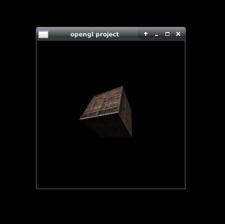

# openglTexturedCube

Basic textured object example. You can rotate the box via 'w','a','s','d','q','e' keys.  

How to run?  
  
You should run the script file in the bin directory :  
./run.sh  

